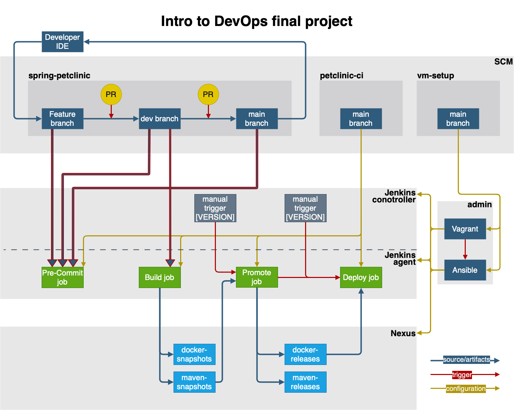

# Petclinic-CI

This repo is a part of Intro to DevOps final project. It's main purpose is to separate CI/CD related files from app repo.

Other parts of this project:
- [Spring-Petclinic repo fork](https://github.com/lipalipinski/spring-petclinic.git)
- [vm-setup repo](https://github.com/lipalipinski/vm-setup.git)

Jenkins pipelines are designed to be used with [Remote Jenkinsfile Provider](https://plugins.jenkins.io/remote-file/). Setet job's Branch Source to app respository, and provide this repo in Jenkinsfile SCM/Repository URL in Build Confiiguration (set mode to Remote Jenkinsfile Provider Plugin). This repository is being checkout into workdir if necessary in the checkout SCM step. Each pipeline sets custom build name like #[build no.] [VERSION].



### **pom.xml modifications**

Add the following block to pom.xml in app repo beetwen `<version>` and `<parent>` tags

```xml
<distributionManagement>
    <repository>
        <id>nexus</id>
        <name>maven-releases</name>
        <url>${env.NEXUS_RELEASES}</url>
    </repository>
    <snapshotRepository>
        <id>nexus</id>
        <name>maven-snapshots</name>
        <url>${env.NEXUS_SNAPSHOTS}</url>
    </snapshotRepository>
</distributionManagement>
```

## Setup

### Nexus repositories
- **maven-central**, **maven-snapshots** and **maven-releases** should be present by default
- create docker registries
    - **docker-snapshots** (create HTTPS connector, use port 18443)
    - **docker-releases** (create HTTPS connector, use port 18444, **disable redeploy**)


### Jenkins configuration

Jenkins is pre-configured when set up with [vm-setup repo](https://github.com/lipalipinski/vm-setup.git). 
- [Plugin Installation Manager Tool for Jenkins](https://github.com/jenkinsci/plugin-installation-manager-tool) installs necessary plugins
- [Configuration as Code Plugin](https://plugins.jenkins.io/configuration-as-code/) sets up default credentials, configures Jenkins Agent and global Jenkins tools

## Jenkins Job Configuration

<hr>

### [Jenkinsfile-PreCommit](Jenkinsfile-PreCommit)
- Set up as a **Multibranch Pipeline**
- branch source: `application repo`
- build configuration: `by Remote Jenkinsfile Provider Plugin`

> PreCommit job:
> - watch for changes being pushed to review to any branch;
> - build project with Maven, including unit tests (if any); this imitates linter work;
> - should NOT upload artifacts to Nexus.

<hr>

### [Jenkinsfile-Build](Jenkinsfile-Build)
- Set up as a **Multibranch Pipeline**
- branch source: `application repo`
- build configuration: `by Remote Jenkinsfile Provider Plugin`


> Build job:
> - watch for updates on "dev" branch;
> - build project with Maven, including unit tests (if any);
> - on successful build:
>    * upload artifacts to Nexus (snapshots repository);
>    * build Docker image with snapshot artifact and upload it to DockerHub snapshot registry. 
>    * Tag image like: petclinic:artifact-version (e.g. petclinic:1.0.0-SNAPSHOT).

<hr>

### [Jenkinsfile-Promotion](Jenkinsfile-Promotion)
- Set up as a **Pipeline**
- Select **This project is parametrised**, set parameters:
    - VERSION (string)
    - GROUP_ID (string) default: `org.springframework.samples`
    - APP_ID (string) default: `spring-petclinic`
- pipeline triggers job `Petclinic-Deploy`, therfore expects it to exists on time of build
- Set `Pipeline script from SCM`
- Uncheck **Lightweight checkout**

Expects parameter VERSION (x.x.x-SNAPSHOT) specifying an artifact version to build. Promotes the newest artifact of specified version found on Nexus repo. 
Additionally, pipeline is checking an artifact with SHA1 checksum.

>Promotion job:
> - triggered manually;
> - takes artifact version as an input parameter; 
> - downloads specified artifact version;
> - changes artifact version to release one;
> - uploads artifact(s) to Nexus (release repository);
> - Build Docker image with released artifact (pulls proper version from Nexus release repo). Tag it like: petclinic:release-artifact-version (e.g. petclinic:1.0.0) and push it to DockerHub release registry.
> - trigger deploy job(release version)

<hr>

### [Jenkinsfile-Deploy](Jenkinsfile-Deploy)
- Set up as a **Pipeline**
- Select **This project is parametrised**, set parameters:
    - VERSION (string)
    - GROUP_ID (string) default: `org.springframework.samples`
    - APP_ID (string) default: `spring-petclinic`
    - REPO_NAME (string) default: `maven-snapshots`
- Set `Pipeline script from SCM`
- Uncheck **Lightweight checkout**

> Deployment job:
> - can be triggered by the Promotion job or manually;
> - receives artifact version as a parameter;
> - runs Docker container on the slave instance. 
> - Make sure that you are able to open the PetClinic start page on 80 port.

<hr>

### [Dockerfile](Dockerfile)

A dockerfile to build a docker image with. Assumes a path to .jar file passed with $jarfile argument on build.

### [mvn-settings.xml](mvn-settings.xml)

Custom maven settings to use on app build. Needed for Nexus proxy, release and snapshot setup.

### [scripts/check-site.sh](scripts/check-site.sh)

A script checking for app response on a port provided with $1 arg. By default it checks in 2s intervals and time-outs after 60s.